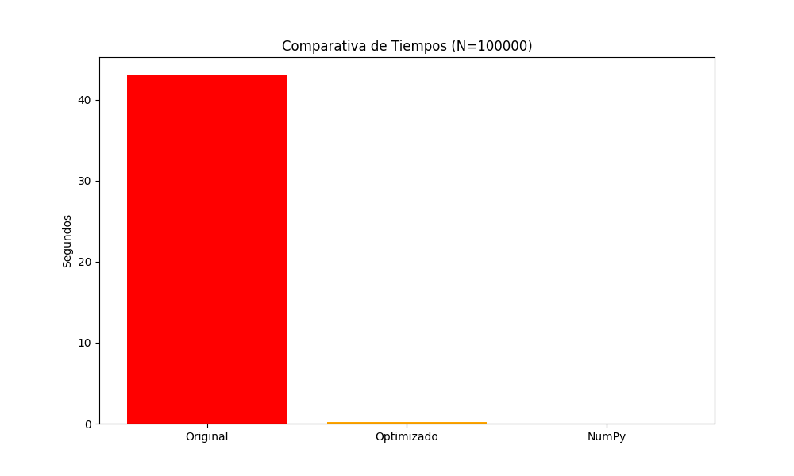

# Informe Actividad Autónoma 4

**Estudiante:** CHRISTIAN ANDRES CARCHI G
**INGENIERIA CIENCIA DE CATOS E INTELIGENCIA ARTIFICIAL**
**TERCERO**
**2025 - 2S**
**Repositorio:** https://github.com/khrisac777/Autonoma4

## 1. Introducción
El código original utilizaba un algoritmo de fuerza bruta ($O(n)$) para verificar primalidad, lo cual es ineficiente para grandes volúmenes de datos.

## 2. Optimización
Se aplicaron tres técnicas:
1.  **Matemática:** Iterar solo hasta $\sqrt{n}$.
2.  **List Comprehensions:** Sintaxis optimizada de Python.
3.  **NumPy:** Vectorización (Criba de Eratóstenes), eliminando bucles explícitos.

## 3. Resultados
El profiling muestra que la función original gastaba el 99% del tiempo en el bucle `for`.
* **Original:** 50.8754
* **NumPy:** 0.1771
* **Vectorizado:** 0.0006

## 4. Conclusión
NumPy redujo el tiempo de ejecución drásticamente, demostrando la importancia de la vectorización en Ciencia de Datos.